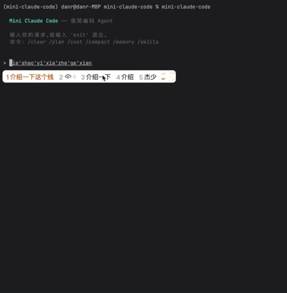

# mini-claude-code

[](https://www.python.org/downloads/)
[](LICENSE)

一个从零开始用 Python 实现的极简版 Claude Code，约 4300 行代码复刻 Agent 核心循环。

## 特性

- **双后端** — Anthropic 原生 API + OpenAI 兼容 API（DeepSeek、Qwen、本地 vLLM 等都能跑）
- **12 个内置工具** — 文件读写、grep、shell、web fetch、计划模式、子 Agent、技能、MCP、工具懒加载
- **5 种权限模式** — `default` / `plan` / `acceptEdits` / `bypassPermissions` / `dontAsk`
- **4 层上下文压缩** — 长会话不爆窗口
- **记忆 / 技能 / 子 Agent / MCP** — 与官方 Claude Code 相同的扩展点
- **彩色 REPL** — 基于 rich 的终端 UI

## 截图



## 环境要求

- Python 3.11+
- 一个 LLM API Key（Anthropic 或任意 OpenAI 兼容服务）

## 安装

```bash
git clone https://github.com/a379324721/mini-claude-code.git
cd mini-claude-code
pip install -e .
```

## 快速开始

```bash
# 设置 API Key
export ANTHROPIC_API_KEY=sk-ant-...

# 运行
mini-claude-code "hello"                  # 一次性模式
mini-claude-code                          # 交互式 REPL
mini-claude-code --yolo "list files"      # 跳过确认
mini-claude-code --plan "refactor this"   # 计划模式
python -m mini_claude_code "hello"        # 也可以用 python -m 方式运行

# 使用 OpenAI 兼容后端
OPENAI_API_KEY=sk-xxx mini-claude-code --api-base https://api.openai.com/v1 --model gpt-4o "hello"
```

## 配置

| 环境变量 | 说明 |
|------|------|
| `ANTHROPIC_API_KEY` | Anthropic API Key（使用原生后端时必需） |
| `OPENAI_API_KEY` | OpenAI / 兼容后端 API Key |

| 命令行参数 | 说明 |
|------|------|
| `--yolo` | 跳过所有权限确认（等同 `bypassPermissions` 模式） |
| `--plan` | 启动计划模式（只读 + 给出方案，不直接动手） |
| `--model <name>` | 指定模型 |
| `--api-base <url>` | 切换到 OpenAI 兼容后端 |

## 文件结构

```
mini-claude-code/
├── pyproject.toml
└── src/
    └── mini_claude_code/
        ├── __init__.py
        ├── __main__.py
        ├── agent.py
        ├── backends/
        │   ├── __init__.py
        │   ├── base.py
        │   ├── anthropic.py
        │   └── openai.py
        ├── tools.py
        ├── prompt.py
        ├── ui.py
        ├── session.py
        ├── memory.py
        ├── skills.py
        ├── subagent.py
        ├── mcp_client.py
        └── frontmatter.py
```

| 文件 | 说明 |
|------|------|
| `agent.py` | Agent 核心循环、4 层压缩、Plan / 子 Agent / Skill 调度 |
| `backends/` | Backend 抽象 + Anthropic / OpenAI 兼容两套实现 |
| `tools.py` | 12 个工具 + 5 种权限模式 |
| `__main__.py` | CLI 入口与 REPL |
| `ui.py` | 终端 UI(rich) |
| `prompt.py` | 系统提示词构造 |
| `session.py` | 会话管理 |
| `memory.py` | 记忆系统 |
| `skills.py` | 技能系统 |
| `subagent.py` | 子 Agent |
| `mcp_client.py` | MCP 客户端 |
| `frontmatter.py` | YAML frontmatter 解析 |

## 与官方 Claude Code 的对比

| 维度 | mini-claude-code | 官方 Claude Code |
|------|------------------|------------------|
| 代码量 | ~4300 行 Python | ~51.2 万行（闭源） |
| 后端 | Anthropic + OpenAI 兼容 | Anthropic 专用 |
| 工具数 | 12 | 更多 |
| 扩展点 | 记忆 / 技能 / 子 Agent / MCP | 同 |
| 权限模式 | 5 种 | 类似 |
| 定位 | 学习 / 二次开发 / 接入开源模型 | 生产工具 |

## 依赖

- [`anthropic`](https://github.com/anthropics/anthropic-sdk-python) — Anthropic SDK（流式）
- [`openai`](https://github.com/openai/openai-python) — OpenAI SDK（兼容后端）
- [`rich`](https://github.com/Textualize/rich) — 终端彩色输出
- [`python-dotenv`](https://github.com/theskumar/python-dotenv) — `.env` 加载

## License

[MIT](LICENSE)

## 致谢

灵感来自 Anthropic 的 [Claude Code](https://www.anthropic.com/claude-code)，本项目为学习目的的极简实现，与官方产品无关联。
